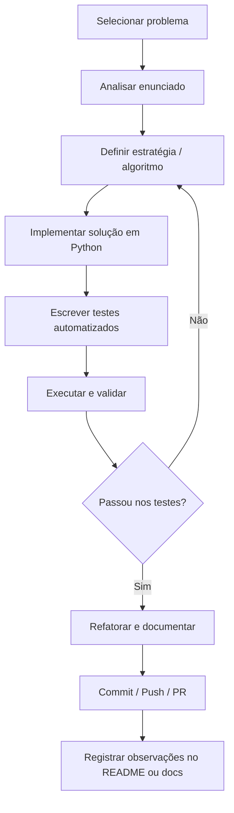

# Laboratorio de Código 👨🏾‍💻


## 🎯 1. Visão Geral do Projeto

Este projeto tem como objetivo praticar e consolidar habilidades de programação por meio da resolução de exercícios e desafios extraídos de plataformas como Beecrowd e LeetCode. A ideia é manter um fluxo constante de aprendizado, registrando soluções, padrões, erros comuns e evolução ao longo do tempo.

O foco principal não é apenas resolver problemas, mas entender profundamente as abordagens, melhorar a lógica, escrever código limpo e evoluir gradualmente em complexidade.

---

## ✅ 2. Objetivos

* Resolver desafios de diferentes níveis de dificuldade
* Desenvolver consistência (code every day mindset)
* Registrar aprendizado e evolução
- Resolver desafios de lógica e algoritmos em níveis: fácil, médio e difícil.
- Construir hábitos de programação (ex.: resolver/estudar ativamente X problemas por semana).
- Praticar boas práticas: código limpo, testes automatizados e documentação.
- Registrar raciocínio e alternativas de solução para futuras consultas.


---

## ⚙️ 3. Tecnologias utilizadas


| Nome da Tecnologia | Motivo da utilização |
|---|---|
| Python | Linguagem principal para resolução de problemas e scripts. Sintaxe clara e ecossistema maduro (bibliotecas e testes). |
| SQL | Prática de consultas, modelagem e manipulação de dados em exercícios que envolvem bancos de dados. |
| Git | Controle de versão, histórico do aprendizado e colaboração (branches, commits). |
| Pytest | Ferramenta de teste para automatizar validação de soluções e exemplos. |
| Markdown | Documentação do repositório e explicações das soluções. |
| Docker | Reproduzibilidade do ambiente quando necessário (ex.: bancos de dados, containers de teste). |
---

## ✍🏾 4. System Design

### 4.1 Fluxo de Desenvolvimento
---

Esse fluxo serve como um checklist para cada exercício: desde a seleção do problema até a documentação da solução e revisão via controle de versão.




### 4.2 Estrutura das pastas
---

```
laboratorio-de-codigo/
├── .github/                      # CI, ISSUE/PR templates
├── docs/                         # arquitetura, convenções, guias
├── solutions/                    # soluções organizadas por plataforma
│   ├── beecrowd/
│   │   ├── easy/
│   │   ├── medium/
│   │   ├── hard/
│   │   └── sql/
│   └── leetcode/
├── dashboard/                     # Dashboard dos exercícios
│   ├── README.md
│   ├── backend/                   # API (opcional: FastAPI) / scripts de coleta
│   │   ├── app/
│   │   │   ├── main.py            # endpoints para métricas
│   │   │   └── api/metrics.py
│   │   └── requirements.txt
│   ├── frontend/                  # Streamlit app ou frontend React
│   │   ├── streamlit_app.py       # versão rápida (Streamlit)
│   │   └── requirements.txt
│   ├── data/                      # saída da coleta: metrics.db / metrics.json / csv
│   └── docker/                    # docker-compose para dashboard
├── tests/                         # pytest tests e integração dashboard
├── utils/                         # helpers reutilizáveis (scan/parse)
├── jobs/                       # scripts utilitários (gerar métricas)
│   └── generate_metrics.py        # varre solutions/ e cria metrics.json/db
├── infra/                         # docker, terraform, configs
└── README.md
```

- **Beecrownd/:** Código de exercícios extraídos da plataforma Beecrowd, com subpastas por tipo.
- **LeetCode/:** Coleção de soluções para problemas do LeetCode, separadas por dificuldade.
- **docs/:** Anotações, diagramas e decisões arquiteturais que não são código.
- **tests/:** Casos de teste e infra para validação automática das soluções.
- **utils/:** Funções de suporte usadas por múltiplos exercícios (por exemplo, leitura de arquivos de entrada).

---

## ✅ 5. Benefícios do projeto

- Permite rastrear progresso técnico ao longo do tempo.
- Serve como portfólio prático com problemas resolvidos e testes.
- Ajuda a consolidar boas práticas (testes, documentação, versionamento).
- Facilita revisões futuras: cada solução contém raciocínio e referências.

---

## 🏁 Conclusão

Este repositório é uma ferramenta de aprendizado contínuo: organiza prática diária, valida soluções com testes e documenta decisões. Com um fluxo simples (escolher, implementar, testar, documentar) o objetivo é transformar consistência em competência técnica.
