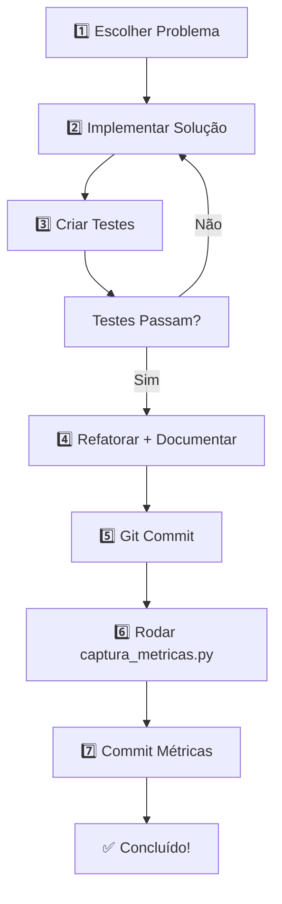

# 🛣️ Roadmap de Desenvolvimento

Guia passo a passo detalhado para resolver novos exercícios de Beecrowd e LeetCode com todas as etapas necessárias.

---

## 📋 **Workflow Completo: Resolução de Novo Exercício**

### **Fase 1️⃣: Preparação**
```
1. Escolha um problema (Beecrowd ou LeetCode)
2. Analise o enunciado e entenda os requisitos
3. Defina a estratégia/algoritmo no papel (pseudocódigo)
4. Crie a pasta e arquivo da solução
```

**Estrutura de pastas:**
```
app/beecrownd/logica/
└── 1020_seu_problema.py

# OU para LeetCode
app/leetcode/
└── problema_name.py
```

---

### **Fase 2️⃣: Implementação da Solução**

Crie o arquivo `.py` com:
```python
# 1020_seu_problema.py

def resolver(entrada):
    """
    Descrição do que o código faz
    
    Args:
        entrada (str): formato de entrada esperado
    
    Returns:
        str: resultado formatado
    """
    # sua solução aqui
    pass

if __name__ == "__main__":
    # Ler entrada
    resultado = resolver(input())
    print(resultado)
```

---

### **Fase 3️⃣: Criar Testes Automatizados ⚠️ OBRIGATÓRIO**

Crie um arquivo de teste correspondente:
```
tests/
└── test_1020_seu_problema.py
```

**Exemplo:**
```python
import pytest
from app.beecrownd.logica.1020_seu_problema import resolver

class TestProblema1020:
    """Testes para o problema 1020"""
    
    def test_caso_1(self):
        """Teste caso 1"""
        entrada = "10\n20"
        assert resolver(entrada) == "resultado_esperado"
    
    def test_caso_2(self):
        """Teste caso 2"""
        entrada = "5\n3"
        assert resolver(entrada) == "resultado_esperado"
    
    def test_caso_invalido(self):
        """Teste caso inválido"""
        with pytest.raises(ValueError):
            resolver("entrada_invalida")
```

**Rodar testes:**
```bash
pytest tests/test_1020_seu_problema.py -v
```

---

### **Fase 4️⃣: Validação e Refatoração**

```
✅ Todos os testes passam?
   ↓
   • Refatore o código para melhor legibilidade
   • Adicione comentários explicativos
   • Otimize performance se necessário
   • Documente a solução
```

---

### **Fase 5️⃣: Documentação da Solução**

Adicione ao arquivo `.py`:
```python
"""
Problema 1020: Seu Problema

📌 Plataforma: Beecrowd
📊 Dificuldade: Fácil
🏷️ Categoria: Lógica

📝 Descrição:
   [Resumo do que o problema pede]

🎯 Abordagem:
   1. Ler os inputs
   2. [Seu passo 1]
   3. [Seu passo 2]
   
⏱️ Complexidade:
   - Tempo: O(n)
   - Espaço: O(1)

🔗 Referência: 
   https://www.beecrowd.com.br/judge/pt/problems/view/1020

💡 Alternativas:
   - [Outra forma de resolver]
   - [Outra abordagem]
"""
```

---

### **Fase 6️⃣: Sobre o Arquivo `metrics.json` 🔄**

**NÃO** você não precisa criar manualmente!

O arquivo `metrics.json` é **gerado automaticamente** pelo script `jobs/captura_metricas.py`.

**Como funciona:**
```bash
# Após resolver vários problemas, rode:
python jobs/captura_metricas.py

# Isso vai:
# 1. Varrer a pasta app/beecrownd/ e app/leetcode/
# 2. Contar problemas resolvidos
# 3. Gerar estatísticas (linguagem, dificuldade, etc)
# 4. Criar/atualizar metrics.json e metrics.db
# 5. Alimentar o dashboard
```

**O que o metrics.json rastreia:**
- Total de problemas resolvidos
- Problemas por plataforma (Beecrowd/LeetCode)
- Problemas por dificuldade (Fácil/Médio/Difícil)
- Distribuição por categoria
- Data da resolução

---

### **Fase 7️⃣: Commit e Versionamento**

```bash
# 1. Adicionar os arquivos
git add app/beecrownd/logica/1020_seu_problema.py
git add tests/test_1020_seu_problema.py

# 2. Commit com mensagem clara
git commit -m "feat: Resolver problema 1020 - Seu Problema

- Implementar solução com abordagem X
- Adicionar testes (3 casos)
- Complexidade: O(n)"

# 3. Atualizar métricas
python jobs/captura_metricas.py
git add metrics.json metrics.db
git commit -m "chore: Atualizar métricas de progresso"
```

---

## 📊 **Resumo Visual do Fluxo**



---

## 🎯 **Checklist por Resolução**

```
☐ Problema resolvido e funcionando
☐ Testes criados (mínimo 2-3 casos)
☐ Todos os testes passam (pytest)
☐ Código refatorado e comentado
☐ Documentação adicionada no arquivo .py
☐ Git commit com mensagem clara
☐ metrics.json gerado e atualizado
☐ Verificar dashboard atualizado
```

---

## 🚀 **Próximos Passos Recomendados**

1. **Criar um exemplo:** Resolva um problema (ex: 1001) seguindo este workflow
2. **Configurar CI/CD:** Adicionar GitHub Actions para rodar testes automaticamente
3. **Melhorar o dashboard:** Exibir métricas em tempo real
4. **Organizar categorias:** Separar problemas por tags (arrays, strings, etc)

---

## 📌 **Referências**

- [README Principal](../README.md) — Visão geral do projeto
- [Estrutura das Pastas](../README.md#42-estrutura-das-pastas) — Organização do projeto
- [Beecrowd](https://www.beecrowd.com.br) — Plataforma de problemas
- [LeetCode](https://leetcode.com) — Plataforma de problemas
